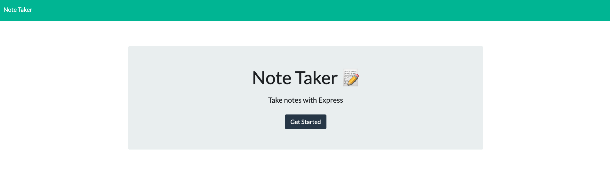
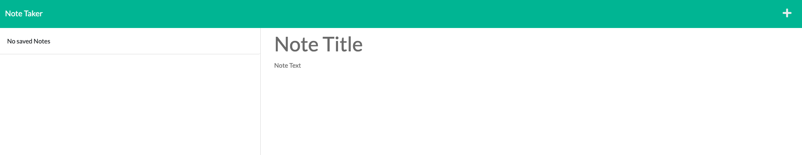
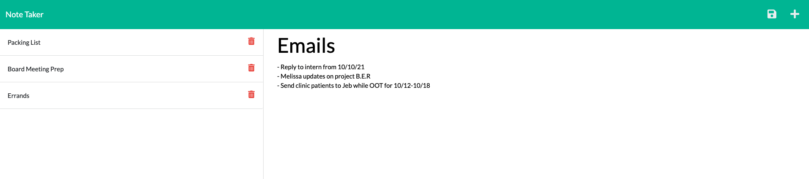

# Note Taker (Bootcamp Assignment 11 - Express.js)

By: Sadie Sial

___


#### Table of Contents

* [Description](#description)
* [Usage](#usage)
* [Technologies](#technologies)
* [Screenshots](#screenshots)
* [Links](#links)
* [Contact](#contact)
* [License](#license)
<br><br>

## Description <br>

This is an web page application built with Express.js using data stored within a JSON file. Users can create, save, and delete their notes from their Note Taker. 


### User Story:

```
AS A small business owner
I WANT to be able to write and save notes
SO THAT I can organize my thoughts and keep track of tasks I need to complete
```

```
GIVEN a note-taking application
WHEN I open the Note Taker
THEN I am presented with a landing page with a link to a notes page
WHEN I click on the link to the notes page
THEN I am presented with a page with existing notes listed in the left-hand column, plus empty fields to enter a new note title and the note’s text in the right-hand column
WHEN I enter a new note title and the note’s text
THEN a Save icon appears in the navigation at the top of the page
WHEN I click on the Save icon
THEN the new note I have entered is saved and appears in the left-hand column with the other existing notes
WHEN I click on an existing note in the list in the left-hand column
THEN that note appears in the right-hand column
WHEN I click on the Write icon in the navigation at the top of the page
THEN I am presented with empty fields to enter a new note title and the note’s text in the right-hand column
```

## Technologies

The technologies used to create this program were: 
- Javascript
- Dynamic HTML
- Express.js
<br><br>

## Screenshots

```
Welcome Screen
```



```
Initial Note Screen
```


```
Completed Sample Screen
```



<br>

## Links

- [Link]()

- [GitHub Repository](https://github.com/sadielinks/note-taker)

<br>

## Contact

- [GitHub Profile](https://github.com/sadielinks)
- [Portfolio](https://sadielinks.github.io/professional-portfolio/)
- [Email](mailto:sadiecodes@gmail.com)

<br>

## License

This source code is available to everyone under the standard [MIT license ©](https://choosealicense.com/licenses/mit/) <br><br>
© 2021 Trilogy Education Services, LLC, a 2U, Inc. brand. Confidential and Proprietary. All Rights Reserved.